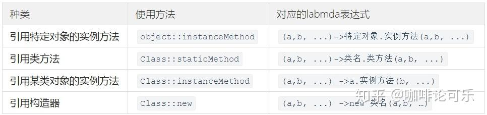
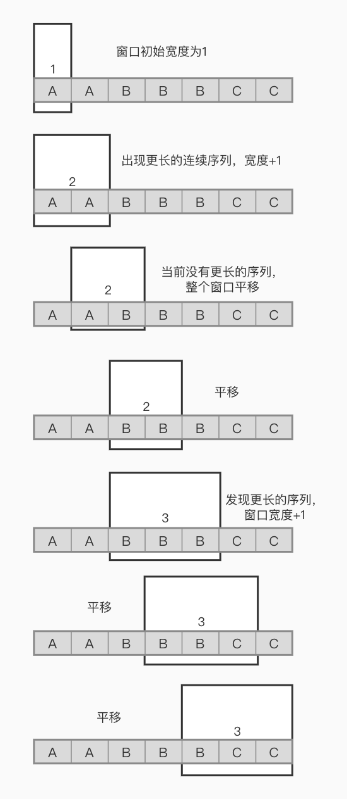
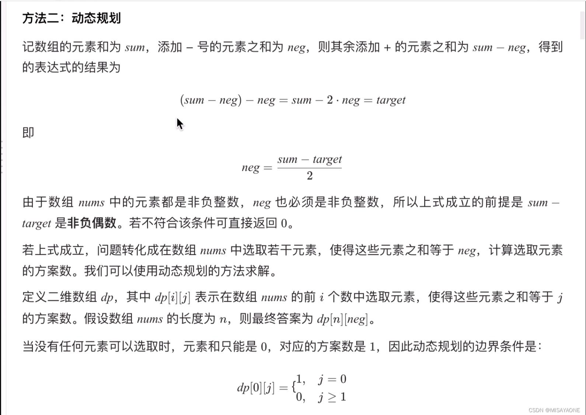
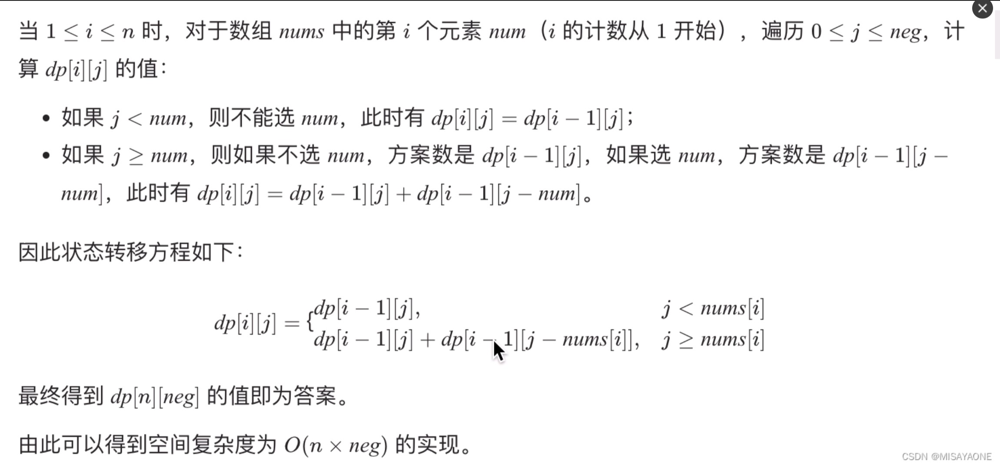

# 每个题所用到的‘技术’

### B1 德州扑克
- Map,HashMap各种用法，entrySet,getValue, getKey, 
- entrySet遍历方法:
  for (Map.Entry<String, Integer> entry:count.entrySet()){
      entry.getValue()
      ...
  }

### B2 字符串子序列II
- 字符串的处理：str.charAt()

### B3 分苹果
- 接收int的方法
  int num = Integer.parseInt(in.nextLine());
- Comparable和Comparator的用法：  
  将最小的挑出来：  
  weights.sort(Comparator.comparingInt(o -> o));  
  或者weights.sort((o1, o2) -> o1 - o2);
  或者weights.sort(Integer::compareTo);  
  倒序：weights.sort(Comparator.reverseOrder());
- 位运算：weightA = weightA ^ weights.get(i);
  * a = 0101
  * b = 1100
  * a &= b: a = 1100
  * |=: 1101
  * 异或^=: 1001
  * 非~
- 还有位运算的 >> <<右移 左移  

### B4 事件推送
- 用"" + [其他类型] 的格式将其他类型转换为字符串

### B5 路灯照明
- 保留小数的方法两种：
  * （不会四舍五入）String.format("%.2f",f);
  * （四舍五入，推荐）DecimalFormat df = new DecimalFormat("#.00");  
    df.format(f);

### B6 补活未成活胡杨
- 滑动窗口：LC#904
- https://zhuanlan.zhihu.com/p/61564531

### B7 统计射击比赛成绩
- 输入为 多行 1,2,3,4,5 这种可以用逗号和换行分隔符
  in.useDelimiter("[,\n]");
- 将以下这种两行输入转换为map，如3=[53,80,55],7=[68,16,100]这种
  * 3,3,7,4,4,4,4,7,7,3,5,5,5
  * 53,80,68,24,39,76,66,16,100,55,53,80,55
  ```
  // 生成map
  Map<Integer, List<Integer>> IDScore = new HashMap<>();
  for (int i = 0; i < N; i++) {
      // getOrDefault如果相同id，获取前面生成的列表，否则生成新的
      List<Integer> list = IDScore.getOrDefault(id.get(i), new LinkedList<>());
      list.add(score.get(i));
      IDScore.put(id.get(i), list);
  }
  ```
- 用.stream().filter()获取map里出现3次以上（value的list长度>=3）的entrySet对象，
  并且升降排序.sorted(lambda expression)
  ```
  IDScore.entrySet().stream().filter(x -> x.getValue().size() >= 3)
        .sorted((o1, o2) -> {
            Integer sum1 = sumScore(o1.getValue());
            Integer sum2 = sumScore(o2.getValue());
            if (sum1.equals(sum2))
                return o2.getKey() - o1.getKey(); // 相同分数按照id大小降序
            else
                return sum2 - sum1; // 分数降序
        })
  ```
- .map()方法使用
- 另一种排序：list.sort(Integer::compareTo);

### B8 高矮个子排队
- try-catch捕获非法输入情况
- 无限序列 转换成List集合的方法：
  Arrays.stream(in.nextLine().split(" "))
  .map(Integer::parseInt)
  .collect(Collectors.toList());
### B9 非严格递增连续数字序列
- char的比较：如果是数字，ch >= '0' && ch <= '9'
- 其他情况，如果是字母等，则取补集
### B10 最大股票收益
- 转换字符串为整数组： 
* 输入：2Y 3S 4S 6Y 8S
* 输出：[2,3,4,6,8]
- 单个char转为int，如果（int）强转，会变成ASCII码，如'2'对应50，
Integer.parInt(String.valueOf(x))
  或者 str.charAt(i) - '0'
  
### B11 （及以后的200分 先空着

### B12 单词重量
- 还是用到保留小数的处理，DecimalFormat可以四舍五入处理任何格式（double，float之类）


### B16 太阳能板最大面积
- 输入数据在多组量比较大的时候，用BufferedInputStream更快：
  Scanner in = new Scanner(new BufferedInputStream(System.in));
- 三目运算符简化：ip.get(left) < ip.get(right) ? ip.get(left++) : ip.get(right--);

### B17 整数对最小和
- arrays数组用IntStream求和：int sum = IntStream.of(nums).sum();

### B20 数大雁
- switch-case的使用，带上default,break

### B22 快速运输
- 就贪婪算法

### B25 乱序整数序列两书之和绝对值最小
- 范围不大的都可以用暴力法直接出
- TreeSet三特性：元素有序（遍历），无重复，无索引
  所以需要排序，需要唯一，但又不需要对索引操作的时候很有用
  
### B27 喊7的次数重排
- 对数组遍历， Arrays.stream(res).forEach()
- String的contains用法，对于一串数字 i，String.valueOf(i).contains("7")

### B33 最长子字符串的长度
（没有技术点）

### B35 快速人名查找
- ****转为String的List的另一种方法：List<String> list = Arrays.asList(in.nextLine().split(","));
- 不不不，直接in.nextLine().split(",");

### B36 寻找相同子串
- 一个字串中找一个子串，只需要boolean str.startsWith(p, i)
- p是要找的子串，i是索引
- 实际上是查找是否以某个prefix前缀开始，只不过i是开始的位置，如果用循环就可以一位一位找子串

### B38 计算最大乘积
- 比较两个字符串公共部分，直接暴力

### B39 磁盘容量排序
- 二维数组排序输出，第一顺序和第二顺序，分别根据int[n][1]和int[n][0],这时用三目：

### B40 符合要求的结对方式

### B41 数组拼接

### B52 数字反转打印
- 金字塔数 - 递归函数

### B53 求字符串中所有整数的最小和
- 对于字符串处理，前后需要比较字符的，最好是string.toCharArray()
- Character.isDigit()判断一个char是否是数字
- Character.digit(i, radix) 将char转为int数字，radix是进制，满进制数返回-1

### B85 最远足迹
- 截取字符串中间的一段，用charArray，找到标志char比较，再记开始位结束位，把原str直接substring掉再转成数字什么的

### B86 运维日志排序
- 用于排序的，：：用法，类名::构造方法
time.sort(Comparator.comparingLong(B86运维日志排序::getTime));
  
  
### B87 观看文艺汇演问题
- 简单
### B88 任务总执行时长
- 简单
### B89 水仙花数
```
  int i = sum % 10; // 获得个位
  int j = sum / 10 % 10; // 获得十位
  int k = sum / 100; // 获得百位
```

### B90 连续自然数之和表达整数

### B95 字符串中找出连续最长的数字串
- 正则表达式匹配，
- 字母数字空格直接匹配自身，
- 点号，.：匹配任意字符（除了换行符）。  
  星号，*：匹配前面的模式零次或多次。  
  加号，+：匹配前面的模式一次或多次。  
  问号，?：匹配前面的模式零次或一次。  
- {n}：匹配前面的模式恰好 n 次。  
  {n,}：匹配前面的模式至少 n 次。  
  {n,m}：匹配前面的模式至少 n 次且不超过 m 次。
- [ ]：匹配括号内的任意一个字符。例如，[abc] 匹配字符 "a"、"b" 或 "c"。  
  [^ ]：匹配除了括号内的字符以外的任意一个字符。例如，[^abc] 匹配除了字符 "a"、"b" 或 "c" 以外的任意字符。
- ^：匹配字符串的开头。  
  $：匹配字符串的结尾。  
  \b：匹配单词边界。  
  \B：匹配非单词边界。
- $1： 正则表达式中第一个子表达式
- .*贪婪，匹配到不能匹配为止，根据后面的正则进行回溯；
- .*?非贪婪，匹配一个后继续进行，不回溯

```
Pattern pattern = Pattern.compile("a");
Matcher matcher = pattern.matcher(str);
while (matcher.find()) {...

// 需要返回内容：
matcher.group();
```

### B96 We Are A Team
- Union Find UF 并查集，模板

---

# 新B，2023Q2-3

### B2 需要打开多少监视器
- 二维数组模板
```
List<List<Integer>> lists = new ArrayList<>();
for (int i = 0; i < m; i++) {
    lists.add(Arrays.stream(in.nextLine().split(" "))
            .map(Integer::parseInt).collect(Collectors.toList()));
}
```

### B5 选修课
- Student类，实现Comparable接口，重写CompareTo方法，分数不同按分数降序，分数相同按照id升序，this在前o在后是升序
- map方法，putIfAbsent，如果没有key，就把value塞进去
- map方法，computeIfAbsent，如果没有key，就把函数塞进去

### B6 五子棋迷
- 双指针法，滑动窗口：
- 长度未知单行输入用Arrays.stream():  
  int[] nums = Arrays.stream(in.nextLine().split(" ")).mapToInt(Integer::parseInt).toArray();
  
### B7 代表团坐车
- 动态规划
  
- 
- 


### B10 寻找最大价值的矿堆 
- DFS图，模板***
- 一行无限长度可以in.nextLine()一行进行split操作，  
无限行如何操作？最大容量后直接设置最大值,或者
```
while (in.hasNextLine()) {
      String ip = in.nextLine();
      if (ip.isEmpty()) break;
```

### B11 最长公共后缀
- 输入包含其他字符，需要被替换掉，如["abc" "bbc" "c"]，用str.replace("[","").replace("\"","")
- 

### B13 比赛
- 二维矩阵转置：j到i 只遍历一半
```
// 转置二维矩阵,j到i 只遍历一半，
for (int i = 0; i < a.length; i++) {
    for (int j = 0; j <= i; j++) {
        int temp = a[i][j];
        a[i][j] = a[j][i];
        a[j][i] = temp;
    }
}
```
- 如果想直接把m行n列输入的转置成n行m列，只需n.fori{m.forj list[j][i] = ...}}

- 比较规则重写：Collections.sort(playerList, (o1, o2) -> {。。。});

### B16 字符串摘要
- map按照value排序，可以转换为List<Map.Entry<>> list再List.sort((o1, o2) -> o2.getValue() - o1.getValue())
- 或者list.sort(Comparator.comparingInt(Map.Entry::getValue));

### B17 稀疏矩阵
- 二维数组读入很简单，只要知道大小/最大范围，直接双层循环，mat[i][j] = in.nextInt();

### B19 报文回路
- Arrays.deepToString(nums)，二维数组/多维数组的全元素打印

### B20 阿里巴巴找黄金宝箱II
- HashSet，去重
- LinkedHashSet，去重，保存原序
- 

### B28 数据分类
- 位运算，将各位加起来
  for (int i = 0; i < 4; i++) {
  sum += (byte) (x >> (i * 8));
  }
- 一个int型，4字节32位的数字x，拆分成4个8位的数字再相加，即把数字x右移8位，和11111111(0xff) 与& 运算

### B30 阿里巴巴找黄金宝箱V
- 滑动窗口，最简单的

### B31 比赛的冠亚季军
- 涉及到多层，多参数，多维度，多...排序，要将对象实现Comparable<对象>接口：
  public static class Athlete implements Comparable<Athlete>
  
### B33 经典屏保

### B38 支持优先级的队列
- PriorityQueue使用方法：  
  .poll()，.peek()取出优先级最高的，最靠前的

### B41 人气最高的店铺
- 用于记录key出现次数的map：shops.put(nums[0], shops.getOrDefault(nums[0], 0) + 1);

### B42 战场索敌
- 典型DFS，模板

### B48 拔河比赛
- 典型的用xx类实现Comparable的排序

### B66 冠亚军排名
- 自定义排序，按照金银铜牌数
```
Arrays.sort(countries, new Comparator<String[]>() {
  @Override
  public int compare(String[] o1, String[] o2) {
    if(o1[1].equals(o2[1]) {
        if (o1[2].equals(o2[2]))
          return Int.par(o2[3]) - ...
         else return Int.par(o2[2]) - ...
    } else return return Int.par(o2[1]) - ...
  }
}
```  

### B78 查字典
- 同一行字符串，以空格分隔，可以每次用in.next()输入一个

### B80 最小数字
- 字符串自定义排序，拼接后排序，如输入21，30，比较2130和3021的大小，就用compareTo():
- Arrays.sort(str, ((o1, o2) -> (o1 + o2).compareTo(o1 + o2)));

### B89 整数编码
- 二进制 ，十六进制转换：
- 十转二：String binary = Integer.toBinaryString(num);
- 二转十六：String hex = Integer.toHexString(Integer.parseInt(bin, 2));

### LC605 种花问题
- 不相邻座位问题，
* 每三个0就可以种一个，不管前后
* 在首尾补0，“防御型编程思想”

### LC1071 字符串的最大公因子
```
//GCD欧几里得最大公因数算法
int x = 6;
int y = 3;
while (y != 0) {
int tmp = x % y;
x = y;
y = tmp;
}
System.out.println(x);
```

### LC345 反转字符串中的元音字母
- 将String中的指定位置字符替换，用stringBuilder.replace(start, end, string)

### LC151 反转字符串中的单词
- 反转字符串列表：使用栈，逆序遍历，头尾交换

### LC283 移动零
- 双指针，慢的用于目标，快的用于大的遍历，慢的都是目标

### LC746 使用最小花费爬楼梯
- 动态规划：
- 五步骤：
1. 确定dp数组（dp table）以及下标的含义：绝大多数题目求什么，我们就如何定义dp数组
2. 确定递推公式：计算 dp[n] 时，是可以利用 dp[n-1]，dp[n-2]……dp[1]，
   要找出数组元素之间的关系式，例如 dp[n] = dp[n-1] + dp[n-2]，
3. dp数组如何初始化：数组初始值为？
4. 确定遍历顺序：是从上往下，从左往右，还是其他顺序，
5. 举例推导dp数组：找dp[1],dp[2]这种初始值
