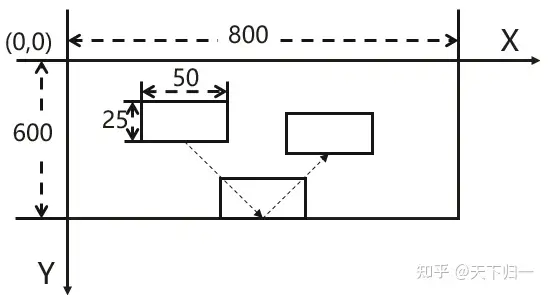
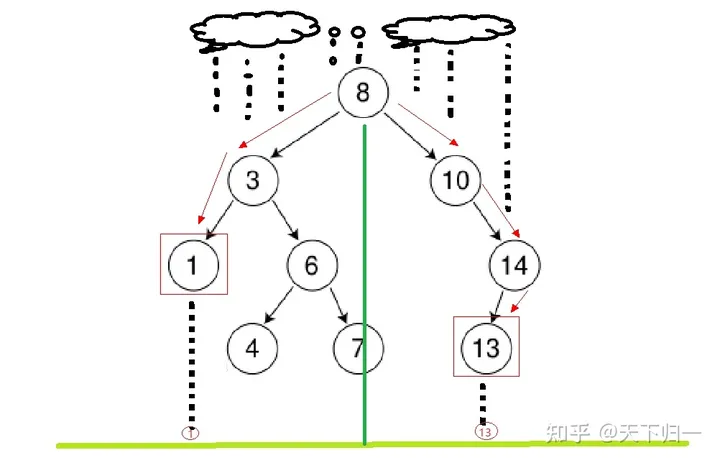
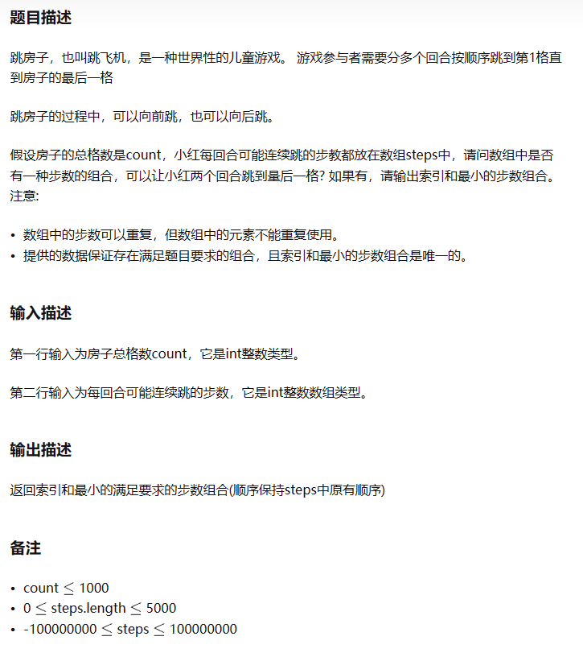
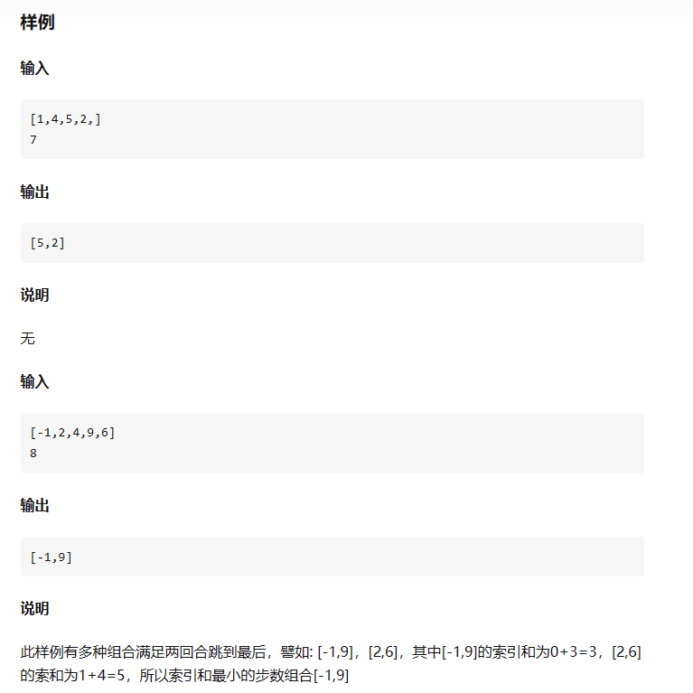

# 刷题策略
B卷复用150（2022Q1-Q3），A卷130（2022Q4 - 2023Q1）,B卷最新76（2023Q2-Q3）
牛客中的题与真题相似的有：HJ5, 14, 22， 31（变体），41，43，51(变体)，85，92，

* 计划正序刷，目前356题，B复 -> A -> B新
- 先100分的，再200分的
- 一天至少得10道
- 自己做出来的（B卷复用85题以后）用 ^ 表示
- 大概的顺序：  
  字符串、单调栈、排序（、递归、广度搜索/深度搜索;  
  而掌握以下几种方式对你解决第三道题目会有意想不到的效果：滑动窗口、前缀和、差分、动态规划、回溯。
  比如经典的最长回文子序列、最长递增子序列、分割数组最大值、组合、全排列等经典题目，
  很有可能考察的不会是原题，但是都是这些题目的基础上衍生出来的。
---
以下是B卷复用：

| 序号   | 题目   | 考点   | 分值 | 
|:--------:|:--------:|:--------:|:--------|
|1|德州扑克|数据结构|200|
|2|字符串子序列II|字符串/双指针|100|
|3|分苹果|位运算|100|
|4|事件推送|数据结构|100|
|5|路灯照明|逻辑模拟|100|
|6|补活未成活胡杨|滑动窗口|100| ***
|7|统计射击比赛成绩|排序算法|100| ***
|8|高矮个子排队|排序算法|100|
|9|非严格递增连续数字序列|双指针|100|
|10|最大股票收益|贪心算法|200|
|11|找朋友|数据结构|200|
|12|单词重量|逻辑模拟|100|
|13|跳格子游戏|拓扑排序|200|
|14|篮球比赛|DFS|200|
|15|勾股数元组|数学|200|
|16|太阳能板最大面积|双指针|100|
|17|整数对最小和|逻辑模拟|100|
|18|最小传输时延II|图论|200|
|19|热点网站统计|排序算法|200|
|20|数大雁|逻辑模拟|100| *****
|21|最长广播效应|数据结构|200|
|22|快递运输|逻辑模拟|100|
|23|打印任务排序|排序算法|200|
|24|高效的任务规划|动态规划|200|
|25|乱序整数排序两数之和绝对值最小|双指针|100|
|26|没有回文串|数位搜索|200|
|27|喊七的次数重排|约瑟夫问题|100|
|28|最少面试官|贪心算法|200|
|29|报文解压缩|数据结构|200|
|30|服务失效判断|并查集|200|
|31|跳格子|图论|200|
|32|任务最优调度|贪心算法|200|
|33|最长子字符串的长度|逻辑模拟|100|
|34|翻牌求最大分|动态规划|100| ***
|35|快速人名查找|回溯算法|100| ****硬记
|36|寻找相同子串|字符串|100| 
|37|城市聚集度|并查集|200|
|38|计算最大乘积|数据结构|100|
|39|磁盘容量排序|排序算法|100| ***
|40|符合要求的结对方式|逻辑模拟|100|
|41|数组拼接|数据结构|100|
|42|出错的或电路|DFS|200|
|43|分积木|位运算|200|
|44|解密犯罪时间|DFS|200|
|45|仿LISP运算|数据结构|200|
|46|九宫格按键输入法|数据结构|200|
|47|书籍叠放|二分法|200|
|48|找最小数|贪心|200|
|49|导师请吃火锅|贪心|200|
|50|最长连续方波信号|数据结构|200|
|51|最长的指定瑕疵度的元音子串|双指针|200|
|52|数字反转打印|逻辑模拟|100| ***
|53|求字符串中所有整数的最小和|逻辑模拟|100|
|54|转骰子|骰子|200|
|55|可以组成网络的服务器|DFS|200|
|56|区间交集|区间问题|200|
|57|分月饼|逻辑模拟|200|
|58|树形目录删除|二叉树|200|
|59|发广播|并查集|200|
|60|简易内存池|区间问题|200|

---
以下都是100分题，从85开始，61-84全是200分的：  
从91开始到150，挑一些前面没做过的类型：  

| 序号   | 题目   | 考点   | 分值 | 
|:--------:|:--------:|:--------:|:--------|
|85|最远足迹|数据结构|100|^
|86|运维日志排序|排序算法|100|
|87|观看文艺汇演问题/计算最多能看几场演出|区间问题|100|
|88|任务总执行时长|逻辑模拟|100|
|89|水仙花数|逻辑模拟|100| ***
|90|用连续自然数之和来表达整数|滑动窗口|100|
|91|水仙花数II|递归算法|100| ***
|95|字符串中找出连续最长的数字串|正则匹配|100| ***
|96|We Are A Team|并查集|100| ***

---
以下是新加题目，2023Q2-Q3

| 序号   | 题目   | 考点   | 分值 | 
|:--------:|:--------:|:--------:|:--------|
|1|宜居星球改造计划|数据结构|200|
|2|需要打开多少监视器|逻辑分析|100|
|3|最佳植树距离|逻辑分析 / 二分法|100| ***
|4|阿里巴巴找黄金宝箱I|前缀和|200|
|5|选修课|数据结构|100| *****
|6|五子棋迷|滑动窗口|100| ****
|7|代表团坐车|动态规划|100| *****
|8|座位调整|逻辑分析|100| ^
|9|食堂供餐|二分法|100| 半^
|10|寻找最大价值的矿堆|DFS / 图|100|
|11|最长公共后缀|字符串|100| 
|12|模拟消息队列|逻辑分析|100| *没有题解
|13|比赛|数据结构|100| ***
|14|告警抑制|逻辑分析|100| *没有题解（有Python） 
|15|报文重排序|字符串处理|100| ^
|16|字符串摘要|字符串处理 / 正则匹配|100| *没有题解（有C++）
|17|稀疏矩阵|逻辑分析|100| 
|18|AI识别面板|数据结构 / 排序算法|100| *抄
|19|报文回路|数据结构|100| ***
|20|阿里巴巴找黄金宝箱II|数据结构|100|^
|21|阿里巴巴找黄金宝箱III|数据结构|100|^
|22|阿里巴巴找黄金宝箱IV|单调栈|200|
|23|文件目录大小|DFS|100| **
|24|组装最大可靠性设备|动态规划|200| *没有题解
|25|找出两个整数数组中同时出现的整数|数据结构|100| *没有题解（有C++）
|26|通过软盘拷贝文件|动态规划|200|
|27|代码编辑器|逻辑分析|200|
|28|数据分类|进制 / 位运算|100| *****
|29|恢复数字序列|滑动窗口|100|
|30|阿里巴巴找黄金宝箱V|滑动窗口|100|^

|31|比赛的冠亚季军|排序算法|100|*****
|32|数字游戏|逻辑分析|100| *半^
|33|经典屏保|逻辑分析|100| 配图：
|34|字符串花间化繁为简|字符串|200|
|35|数据最节约的备份方法|二分法|100| ***
|36|跳格子2|逻辑分析|100| *半^
|37|跳房子2|数据结构，排序？|200|
|38|支持优先级的队列|数据结构 / 优先队列PQ|100| *****
|39|乘坐保密电梯|回溯法/递归|100| *****抄
|40|计算最接近的数|逻辑分析 / 滑动窗口|100| *抄

|41|人气最高的店铺|逻辑分析|100| *****抄
|42|战场索敌|DFS|200| 
|43|二维伞的雨滴效应|二叉树|100|  *****
|44|跳房子I|数据结构|100|   

---
以下只是过一遍

|45|分割数组的最大差值|逻辑分析|100| 简单，略过
|46|生日礼物|二分法|100|  *没有题解
|47|求最小步数|逻辑分析|100| * 背  
|48|拔河比赛|数据结构|100| ^
|49|评论转换输出|回溯法/递归|200|
|50|树状结构查询|数据结构/树？？？|200|

|51||数据结构|200|
|52||数据结构|200|
|53|符合要求的元组个数/K数之和|回溯法/递归|100| *没有题解
|54||数据结构|200|
|55|金字塔/微商的收入|数据结构 / 自定义 排序算法|100|
|56|矩阵元素边界值|字符串处理|100| 简单，略过
|57||数据结构|200|
|58||数据结构|200|
|59||数据结构|200|
|60|增强的strstr|正则匹配|100|

|61|关联子串|字符串处理|100| * 背
|62|计算礼品发放的最小分组数目|双指针|100|
|63|字符匹配|正则匹配|100|
|64||数据结构|200|
|65|一种字符串压缩表示的解压|正则匹配|100| 复杂，弃
|66|冠亚军排名|排序算法|100| 简单，略过
|67|报数游戏|逻辑分析 / 约瑟夫问题 |100| ***
|68|找出经过特定点的路径长度|逻辑分析|100| 简单，略过
|69|按单词下标区间翻转文章内容|字符串处理|100| 简单，略过
|70|数列描述|逻辑分析|100|

|71|字符串筛选排序|排序算法|100| 简单，略过
|72|相对开音节|正则匹配|100| 简单，略过
|73|字符串变换最小字符串|字符串处理|100| 简单，略过
|74|VLAN资源池|数据结构|100| 简单，略过
|75|拼接URL|字符串处理|100| 简单，略过
|76|执行时长/GPU算力|逻辑分析|100| 简单，略过
|77||数据结构|200|
|78|查字典|字符串处理|100| 简单，略过
|79||数据结构|200|
|80|最小数字|排序算法|100| 简单，略过[字符串拼接比大小]

|81|最长的元音子串|字符串|100| 简单，略过[两个列表比较]
|82|TLV解析II|数据结构|100| 复杂，
|83||滑动窗口|200|
|84|最长连续子序列|滑动窗口|100|
|85|路灯照明II|区间合并|100| 未刷，基本会做
|86|最多团队|排序算法|100| 未刷，基本会做[两个指针向中间移动]
|87|最长的顺子|数据结构|100| 
|88|数字最低位排序|排序算法|100| 未刷，基本会做
|89|整数编码|字符串|100|
|90|找车位|逻辑分析|100|
|91|选举拉票|数据结构|200|
|92|单词加密|字符串|100|

